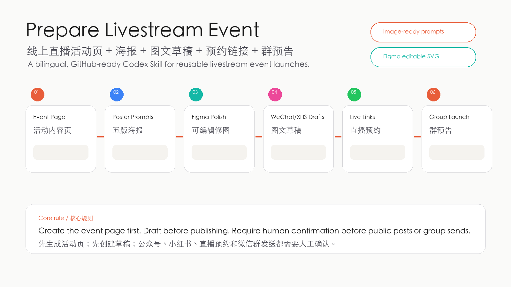
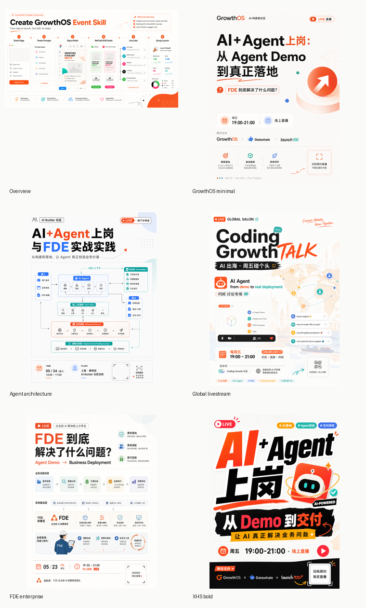

# Prepare Livestream Event · 线上直播活动发布 Skill

**中文** | [English](README.en.md)

> 一个主题，一套素材，一次确认后再发布。
> One brief, one launch package, publish only after approval.

一个用于准备线上直播活动的 Codex Skill：把活动 brief、Notion 页面或草稿内容，整理成活动内容页、五版海报方向、公众号/小红书图文草稿、直播预约链接记录和微信群预告。

它不是自动发帖机器人。它更像一个活动运营搭子：先把内容、图片、文案和发布清单准备好，再让人确认，最后再发布。

诞生于 GrowthOS / Coding GrowthTALK 的真实活动准备流程。



本地展示页：双击打开 `examples/showcase.html`。  
发布介绍文案：见 `examples/promo-copy.md`。

## 里面有什么

- **活动内容页** — 把主题、时间、嘉宾、议程、适合人群、CTA 和链接整理成统一结构。
- **五版海报方向** — 为 Image 2.5 / 当前可用图片模型准备五种不同视觉方向的 prompt。
- **平台尺寸表** — 覆盖公众号头图、正文海报、小红书 3:4 封面、方图和横图。
- **图文文案模板** — 公众号、小红书、微信群预热、最终群通知都先生成草稿。
- **发布确认机制** — 创建草稿可以自动化，但公众号发布、小红书发布、直播预约和微信群发送都必须人工确认。

## 示例

| 五版海报方向 | 真实 GrowthOS 案例 |
|---|---|
|  |  |

这套 Skill 默认参考 GrowthOS 当前的活动视觉语言：纸张拼贴、橙黑对比、超大标题、直播时间条、联合主办方、真实讨论问题、发起人信息和二维码 CTA。

如果你有自己的社群风格，可以直接改 `references/growthos-brand.md` 和 `references/copywriting-templates.md`。

## 安装

适用于支持 `SKILL.md` 约定的 AI agent。推荐直接安装到 Codex skills 目录：

```bash
mkdir -p "${CODEX_HOME:-$HOME/.codex}/skills"
git clone https://github.com/flicy/prepare-livestream-event.git \
  "${CODEX_HOME:-$HOME/.codex}/skills/prepare-livestream-event"
```

重启 Codex 后，直接说：

```text
用 prepare-livestream-event，根据这个活动主题生成内容页、五版海报 prompt、公众号文案、小红书文案和微信群预告。
```

## 快速试用

```bash
python3 scripts/normalize_event.py templates/event-template.json -o /tmp/event.json
python3 scripts/plan_image_sizes.py > /tmp/poster-sizes.json
python3 scripts/build_poster_prompts.py /tmp/event.json -o /tmp/poster-prompts.json
```

然后把 `/tmp/poster-prompts.json` 接到你的图片生成流程。选定海报方向后，再进 Figma 或其他设计工具处理最终文字、二维码和安全区。

## 文件结构

```text
.
├── README.md
├── README.en.md
├── SKILL.md
├── LICENSE.md
├── agents/
│   └── openai.yaml
├── examples/
│   ├── overview.png
│   ├── overview-editable.svg
│   ├── showcase.html
│   ├── promo-copy.md
│   ├── poster-directions.png
│   └── real-growthos-cases.png
├── templates/
│   ├── event-template.json
│   └── event-template.yml
├── references/
│   ├── event-schema.md
│   ├── growthos-brand.md
│   ├── poster-sizes.md
│   ├── copywriting-templates.md
│   └── publishing-adapters.md
└── scripts/
    ├── normalize_event.py
    ├── plan_image_sizes.py
    └── build_poster_prompts.py
```

`examples/` 是给人看的公开案例；`templates/`、`references/` 和 `scripts/` 是 Skill 真正工作时会用到的材料。

## 改成自己的社群风格

最常改的地方：

- `templates/event-template.yml`：你的常规活动字段。
- `references/growthos-brand.md`：品牌色、视觉气质、海报风格。
- `references/copywriting-templates.md`：公众号、小红书和群消息语气。
- `references/poster-sizes.md`：如果你的渠道尺寸不同，在这里改。
- `examples/`：替换成你的真实活动案例，让 Skill 更懂你的风格。

## 反馈不好用的 case

欢迎把失败案例整理成 issue。比如：

```text
Use $prepare-livestream-event. Report to Issue:
小红书海报文字太密，公众号头图标题没有放进中间安全区，群预告文案太像 AI。
```

特别有价值的坏 case：

- 海报不像你的社群风格。
- 中文标题太挤或不可读。
- 公众号头图没有照顾中间方形安全区。
- 小红书标题不够抓人。
- 文案太空、太 AI、没有真实活动感。
- 二维码、直播预约链接、公众号文章链接没有关联清楚。

不要在公开 issue 里放私密二维码、群链接、账号后台截图或未公开活动信息。

## 协议

MIT License. See [LICENSE.md](LICENSE.md).
