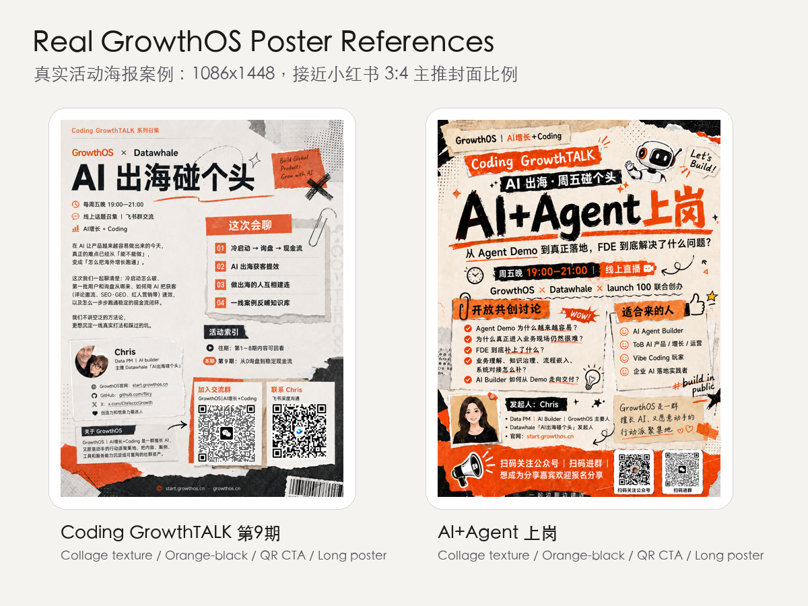

# Prepare Livestream Event

Version: 1.0

把线上直播活动 brief、Notion 页面或活动草稿整理成活动内容页、五版海报方向、公众号/小红书图文草稿、直播预约链接和微信群预告的 Codex Skill。

A Codex Skill for turning livestream event briefs into event pages, poster directions, WeChat/Xiaohongshu drafts, live reservation links, and group announcement copy.

GitHub: https://github.com/flicy/prepare-livestream-event

## 省流图文版


可编辑版本：

- PNG: `assets/examples/readme-intro-screenshot.png`
- Figma-importable SVG: `assets/examples/readme-intro-editable.svg`
- AI visual overview: `assets/examples/readme-visual-overview.png`

把 SVG 拖进 Figma 后，可以继续修改文字、颜色、形状和版式。

## 介绍文案

做了一个 Codex Skill：Prepare Livestream Event。

起因很简单：我自己在做 GrowthOS 和 Coding GrowthTALK 这类线上直播活动时，发现每次准备活动都要重复很多事情：先整理活动内容页，再做海报，再写公众号和小红书预告，再创建直播预约链接，最后还要给微信群写预热和正式通知。

这个 Skill 会帮你把一场线上直播活动从「一个主题/一页 Notion/一段活动 brief」，快速整理成一个可发布的活动包：活动内容页、五版不同风格的海报生成 prompt、公众号图文草稿、小红书图文草稿、直播预约链接记录和微信群预告文案。

如果你也在做社群直播、线上分享、AI Builder 活动、产品共创会、训练营公开课，可以拿来试试。也欢迎把不好用的 case 丢给我，比如海报不像你的社群风格、中文排版太挤、公众号文案太 AI、小红书标题不够抓人、二维码位置不对、直播链接关联不顺。这个项目会继续迭代，我想把它做成一个真正能稳定支撑社群活动发布的小工具。

省流图文版：见上图

GitHub: https://github.com/flicy/prepare-livestream-event

真实实践：下面两张 GrowthOS 活动海报已经放进仓库作为公开案例。

## What It Does

- Normalizes a livestream event brief into a reusable event schema.
- Creates an event content page before poster work.
- Generates five Image 2.5-ready poster directions:
  `growthos-minimal`, `agent-architecture`, `global-livestream`, `fde-enterprise`, and `xiaohongshu-bold`.
- Plans platform image sizes for WeChat Official Account, Xiaohongshu, and Jike.
- Produces WeChat Official Account, Xiaohongshu, warm-up, and WeChat group announcement drafts.
- Keeps Figma refinement in the loop for title layout, QR codes, typography, and safe areas.
- Prioritizes live reservation workflows for WeChat Channels and Xiaohongshu Live.
- Keeps publishing, live reservation creation, and WeChat group sending behind explicit human confirmation.

## Install

Recommended: install directly from GitHub into your Codex skills directory.

```bash
mkdir -p "${CODEX_HOME:-$HOME/.codex}/skills"
git clone https://github.com/flicy/prepare-livestream-event.git \
  "${CODEX_HOME:-$HOME/.codex}/skills/prepare-livestream-event"
```

If you already have the repo locally, copy the folder:

```bash
mkdir -p "${CODEX_HOME:-$HOME/.codex}/skills"
cp -R ./prepare-livestream-event "${CODEX_HOME:-$HOME/.codex}/skills/"
```

Restart Codex after installation so the new skill is loaded.

Use it in Codex:

```text
Use $prepare-livestream-event to prepare a livestream event launch package for this activity brief.
```

中文调用示例：

```text
用 prepare-livestream-event，根据这个活动主题生成内容页、五版海报 prompt、公众号文案、小红书文案和微信群预告。
```

## Quick Start

Use the dependency-free JSON template:

```bash
python3 scripts/normalize_event.py assets/event-template.json -o /tmp/event.json
python3 scripts/plan_image_sizes.py > /tmp/poster-sizes.json
python3 scripts/build_poster_prompts.py /tmp/event.json -o /tmp/poster-prompts.json
```

Then use `/tmp/poster-prompts.json` with your image generation workflow. After choosing a poster direction, refine final text, QR codes, and platform safe areas in Figma or your preferred design tool.

`assets/event-template.yml` is also included as a more human-readable template. YAML input requires PyYAML; JSON works with the Python standard library.

## Structure

```text
.
├── SKILL.md
├── README.md
├── LICENSE
├── agents/
│   └── openai.yaml
├── assets/
│   ├── brand/
│   ├── event-template.json
│   ├── event-template.yml
│   └── examples/
├── references/
│   ├── copywriting-templates.md
│   ├── event-schema.md
│   ├── growthos-brand.md
│   ├── poster-sizes.md
│   ├── productization-roadmap.md
│   └── publishing-adapters.md
└── scripts/
    ├── build_poster_prompts.py
    ├── normalize_event.py
    └── plan_image_sizes.py
```

The installable skill is the repository root. Example images are included because this skill is easier to understand when the visual target is visible.

## Poster Examples

These five sample posters are visual references for the built-in directions.


Individual files:

- `assets/examples/poster-growthos-minimal.png`
- `assets/examples/poster-agent-architecture.png`
- `assets/examples/poster-global-livestream.png`
- `assets/examples/poster-fde-enterprise.png`
- `assets/examples/poster-xiaohongshu-bold.png`

For production, treat image-generation output as concept art. Final Chinese typography, QR codes, and platform safe-area crops should be checked in Figma.

## Real GrowthOS Cases

These real GrowthOS activity posters are included as public reference cases. Both are close to the Xiaohongshu 3:4 cover format and work well as master vertical posters for livestream promotion.



Case files:

- `assets/examples/real-cases/coding-growthtalk-issue-9.png`
- `assets/examples/real-cases/coding-growthtalk-agent-fde.png`

The shared visual language is warm paper collage, orange-black contrast, oversized title, live time row, organizer line, practical discussion bullets, host card, and QR-driven CTA.

## Platform Sizes

Core export targets:

- WeChat Official Account cover: `900 x 383`, with the key title inside the center `383 x 383` safe square.
- WeChat secondary cover: `200 x 200`.
- WeChat article poster: `900 x 500`, `750 x 1334`, or `800 x 800`.
- Xiaohongshu main cover: `1080 x 1440`, preferred for event posters.
- Xiaohongshu square: `1080 x 1080`.
- Xiaohongshu horizontal fallback: `1200 x 900`.

See `references/poster-sizes.md` for details.

## Customize For Your Community

Most teams should change these files first:

- `assets/event-template.yml`: recurring livestream event structure and default fields.
- `assets/event-template.json`: dependency-free template for scripts and automation.
- `references/growthos-brand.md`: colors, fonts, tone, visual motifs, logo TODO, and CTA language.
- `references/copywriting-templates.md`: WeChat, Xiaohongshu, group, and short-post templates.
- `references/poster-sizes.md`: platform sizes if your channels use different dimensions.
- `references/publishing-adapters.md`: browser-assisted draft workflow, account tools, and manual fallback.

To adapt this from GrowthOS to another livestream brand:

1. Replace the palette and typography in `references/growthos-brand.md`.
2. Replace or remove `assets/brand/growthos-logo-draft.png`.
3. Rewrite the community tone phrases and CTA language.
4. Update the default host, organizer, QR placeholders, and link fields in the event templates.
5. Rewrite copy templates so the voice sounds like your brand.
6. Keep the confirmation gates unless your team has a separate approval system.

## Publishing Notes

WeChat Official Account, Xiaohongshu, live reservation platforms, and WeChat groups all have different access models. This skill defaults to browser-assisted draft creation for WeChat Official Account and Xiaohongshu.

Recommended adapter order:

1. Browser-assisted draft creation with the user's logged-in account.
2. Manual publishing package with Markdown, images, and checklist.
3. Official API or connected app tool, only when the account and API access are clearly available.

Priority live reservation platforms:

- WeChat Channels.
- Xiaohongshu Live.

Do not publish, schedule, reserve, or send from a real account unless the operator explicitly approves the final draft.

## Report Bad Outputs

When the generated event package fails, ask Codex to capture an issue draft:

```text
Use $prepare-livestream-event. Report to Issue: the Xiaohongshu poster text is too dense, the WeChat cover safe area is wrong, and the group announcement sounds too generic.
```

Useful bad cases:

- Poster does not match the target community style.
- Chinese text is unreadable or too crowded.
- WeChat cover title is outside the center square safe area.
- Xiaohongshu title is not strong enough.
- The copy sounds too generic or too AI-like.
- QR code / live reservation link / article link is not associated correctly.
- Browser-assisted draft steps are unclear or blocked.

Do not include private QR codes, account screenshots, group links, or unpublished event details in public issues unless you explicitly intend to share them.

## Iteration History

- `1.0`: Initial GrowthOS livestream event launch workflow. Includes event schema, five poster directions, platform copy templates, browser-assisted publishing notes, real GrowthOS poster references, and GitHub-ready installation.

## English Summary

`prepare-livestream-event` helps community operators and AI builders prepare repeatable livestream launch packages. It turns an event idea or source page into a structured event page, five poster directions, platform-specific copy, live reservation link tracking, and final WeChat group announcement drafts. It is intentionally semi-automatic: drafts and assets are generated quickly, but publishing and group sending stay behind human confirmation.

## License

MIT License. See `LICENSE`.
